## Machine Learning

- Machine Learning is the science (and art) of programming computers so they can learn from data.
- Machine Learning is the field of study that gives computers the ability to learn without being explicitly programmed.
- A computer program is said to learn from experience E with respect to some task T and some performance measure P, 
if its performance on T, as measured by P, improves with experience E.

### Machine Learning Type
  - Supervised(监督学习)
  - Unsupervised(非监督学习)
  - Semisupervised(半监督学习)
  - Reinforcement(强制学习)
  - Online(在线学习)
  - Batch(批量学习)
  - Instance-based(基于实例学习)
  - Model-based(基于模型学习)
  
#### 监督学习
监督学习，训练数据包含目标结论(目标结论也叫“标签”)。

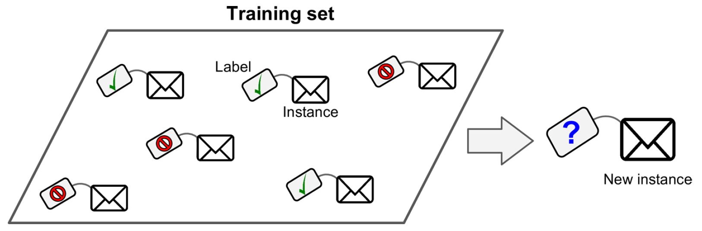

  - 监督学习的一个典型的任务是: 分类(Classification)，比如垃圾邮件过滤器，用很多垃圾邮件的案例来训练，然后学习如何分类新邮件。
  - 监督学习的另一个典型任务是: 回归(Regression)，预测(Predict)一个目标数值，比如二手车的价格，给出一组功能数据(里程数，车龄，品牌等)，这些数据叫做“预测器”(predictors)。
  训练系统时，需要提供很多二手车的案例数据，包括"预测器"和"标签(即价格)"。

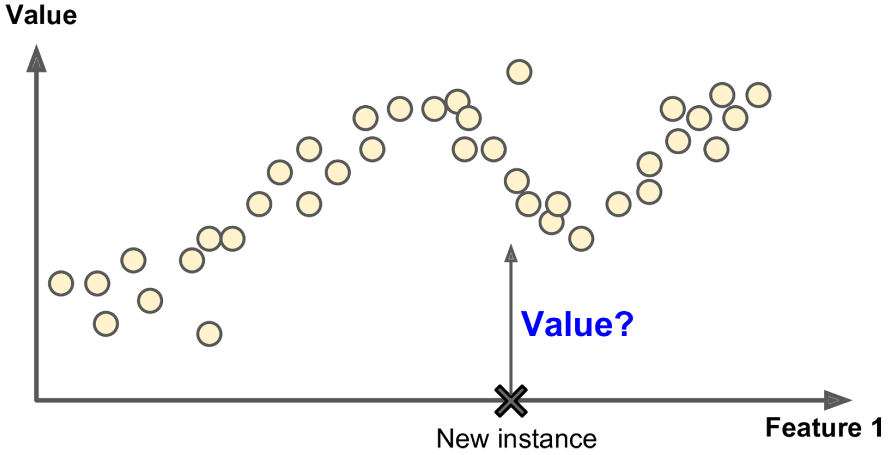

回归算法和分类算法可以互用，逻辑回归(Logistic Regression)一般用于分类，因为它可以输出一个对应某个给定分类的概率值(比如20%概率为垃圾邮件)。
监督学习的重要算法有:
  - K最近邻算法(k-Nearest Neighbors)
  - 线性回归(Linear Regression)
  - 逻辑回归(Logistic Regression)
  - 支持向量机(Support Vector Machines (SVMs))
  - 决策树和随机森林(Decision Trees and Random Forests)
  - 神经网络(Neural networks)，(神经网络也可以是非监督学习)
  
#### 非监督学习
非监督学习，训练数据不包含目标结论(目标结论也叫“标签”)，系统不需要被教导如何学习。

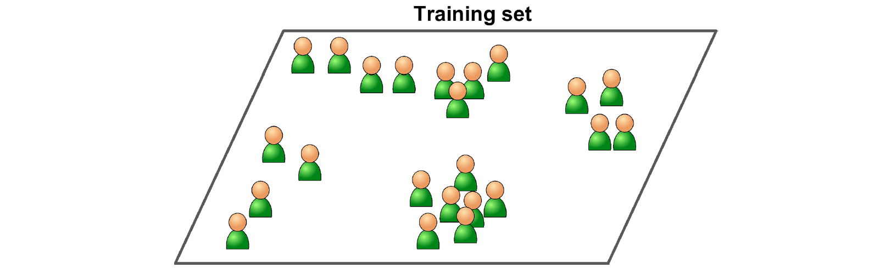

非监督学习的重要算法有:
  - 聚类算法(Clustering)
    - k-Means 算法
    - 层次聚类算法(Hierarchical Cluster Analysis (HCA))
    - 最大期望算法(Expectation Maximization (EM))
  - 可视化和降维 (Visualization and dimensionality reduction)
    — 主成分分析(Principal Component Analysis (PCA))
    — 核心主成分分析(Kernel PCA)
    — 局部线性嵌入(Locally-Linear Embedding (LLE))
    — t-分布随机邻域嵌入算法(t-distributed Stochastic Neighbor Embedding (t-SNE))
  - 关联规则学习(Association rule learning)
    - Apriori 算法
    - Eclat 算法

- 比如有一些自己Blog的访客数据，聚类算法可以检测出相似的访客，算法在不提前知道访客属于哪个分类的情况下，可以找独立找出分类，
例如算法可以找出40%的访客是男性，并且在晚上访问自己的Blog，20%的访客是科幻小说迷，并且喜欢在周末访问自己的Blog。
使用层次聚类算法可以把这个分类拆分的更细。

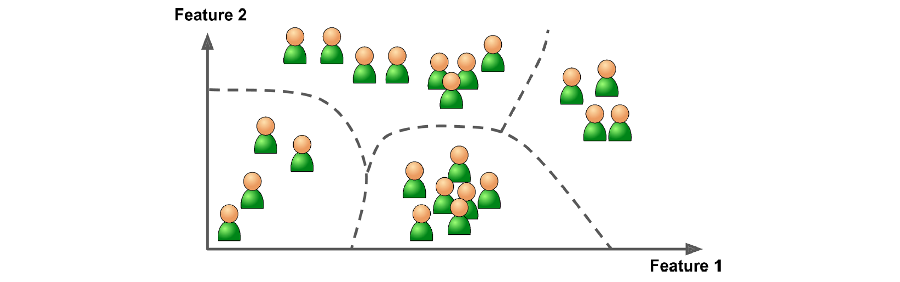

- 可视化算法也是个好例子：给出大量复杂的无标签的数据，算法输出2D或3D的可以被绘制数据表现。
算法保存尽可能多的结构(比如在重合的可视化图中保持不同的聚类)，这样就可以理解数据如何组织并识别未知的模式。

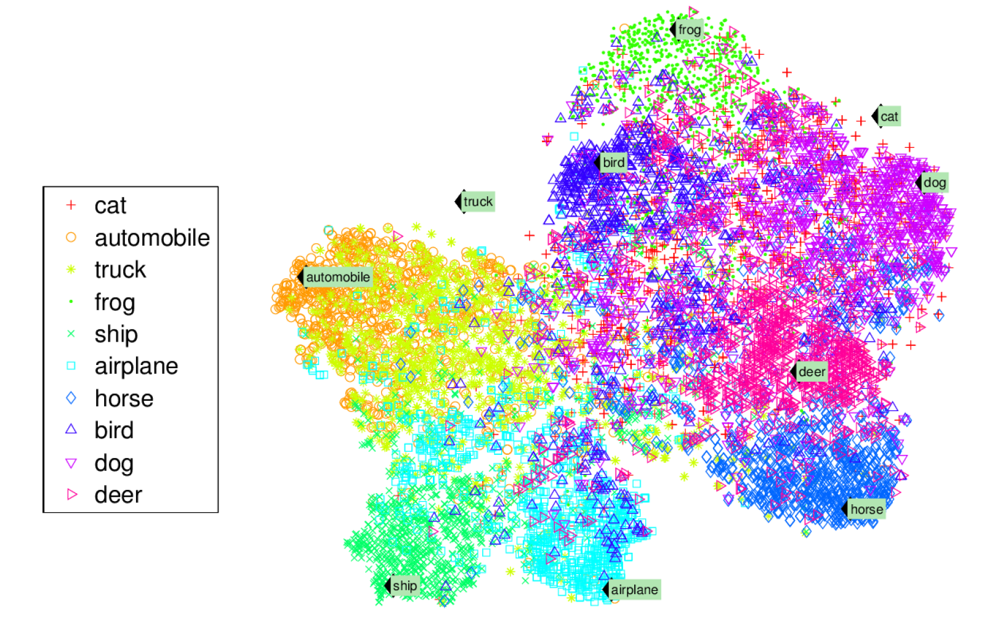

- 一个降维的目标是：不丢失太多信息的前提下简化数据。
一种方式是，把几个想关的功能合并为一个，比如车的里程数与车龄非常相关，所以降维算法会把这些数据合并为一个数据：车的磨损。

- 另一个重要的任务是异常检测(Anomaly Detection)，
比如：检测信用卡的非正常交易以防止欺诈；捕捉生产缺陷，自动从数据集中移除异常值，以免进入另一个学习算法。
系统用正常数据训练，当检测新数据时可以判断是否正常。 

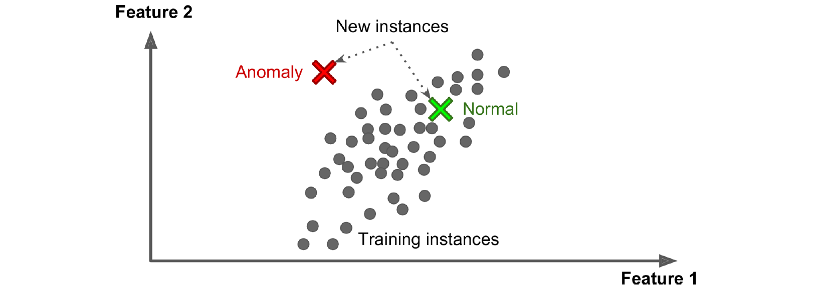

- 关联规则学习：目标是从大量数据中挖掘出感兴趣的关系。
比如运营一个超市时，在销售日志中可以发现发烤肉酱和土豆片的人通常还买牛排，这样就可以把这些东西的货架放置在一起。

#### 半监督学习
半监督学习，处理只有部分数据打标签的情况，一般是大量未标记数据的和少量标记的数据。
比如使用Google的照片云存储上传照片时，算法能自动识别同一个人A在照片1，5，11中，另一个人B在照片2，5，7中，这就是聚类算法的非监督学习。
系统需要你告诉它这些人是谁，每个人设置一个标签，系统就可以在所有照片中找到所有的人了。

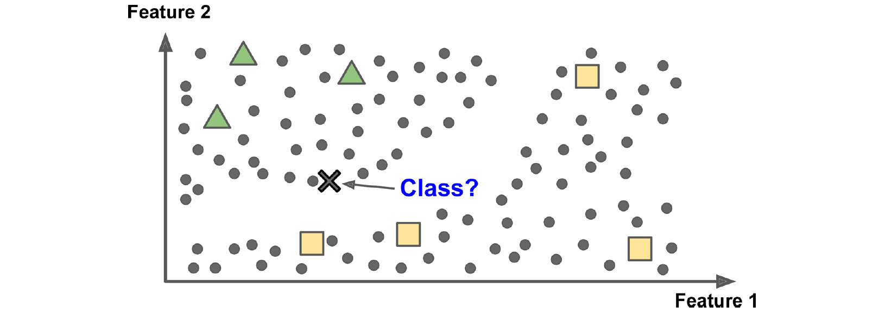

- 大多数半监督学习算法是监督学习和非监督学习的组合。
比如，深度信念网络(deep belief networks (DBNs)) 基于非监督学习的一个组件，叫做“有限Boltzmann机(restricted Boltzmann machines (RBMs))”，
RBMs 以非监督学习的方式有序地训练，然后整系统使用监督学习技术调优。

#### 强化学习
强化学习大不一样。学习系统叫做 “Agent”，可以观察环境，选择并执行“Action”，得到返回的"Rewards"，或得到负面的“Penalties”。
学习系统必须自己学习什么是最好的策略，策略叫做“Policy”，以获取最好的"Rewards"，“Policy” 定义了"Agent"在所处的情况下应当选择的最好的“Action”。

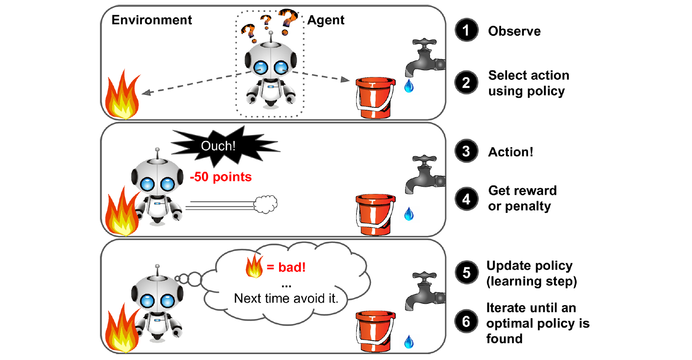

- 比如机器人实现了强化学习，以学习如何行走。AlphaGo 打败了李世石，AlphaGo 通过分析几百万的对战来学习战胜策略，并且与自己对战了很多次。
注意: 学习系统在对战李世石时是关闭了的。AlphaGo只是运用了已经学到的策略。

#### 离线学习(批量学习)
批量学习，系统不会渐近式学习，必须用所有已有的数据训练。这样会花大量时间和计算资源，所以一般是离线完成的。
一旦系统被训练了，然后就会进入产品阶段运行，不会再学习了。只是运用已经学会的东西，也叫“离线学习”。

- 如果想让学习系统学习新的数据，需要从0开始训练新版本的系统(新老数据一起训练)，然后停止老系统，用新系统替换。
- 根据数据更新的频度，需要制定适合的训练频率，比如每24小时训练一次，一次几小时
- 训练数据需要大量的CPU、IO、内存、磁盘资源，所以如果数据量很大，成本有限，环境有限，则是不可能完成的(比如在手机上)

#### 在线学习(渐近学习)
在线学习，有序地提供一条或一小组新数据，渐近式地学习，新数据叫做小批量数据(mini-batches)。
每个学习步骤都很便宜快捷，这样系统就可以在新数据到来时在线学习新数据。

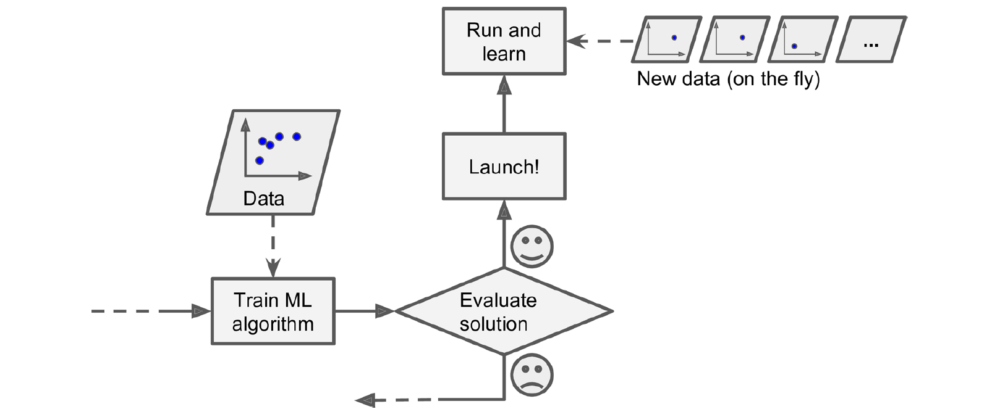

- 在线学习适合不间断地数据流(比如股票价格)，然后快速或自动地适配。
- 还有一种场景是计算资源有限，学习系统学习了新数据后，老数据可以被丢弃，以节省存储空间。
- 还适用于当数据集大到内存无法放下时，叫做out-of-core学习(核外学习)，系统加载部分数据，然后一步步计算。

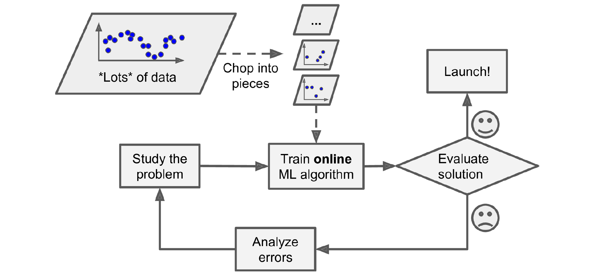

一个重要的数数是：系统能够以多快的速度适配新数据，叫做“学习率(learning rate)”。
- 如果学习率高，系统可以快速学习新数据，但也会快速忘记老数据。
- 如果学习率低，系统会比较迟钝，但也不会被新数据中的无效数据那么敏感。

对于在线学习的挑战是：坏数据被喂进系统，系统性能会下降，尤其在在线系统中，客户会察觉到，所以需要异常检测(Anomaly Detection)算法。

#### 基于实例学习
大多数机器学习的任务是：预测。也就是给出一定量的示例训练数据，系统需要能泛化没有见过的示例数据。
最琐碎的学习形式大概是用心学习。如果用这种方式创建垃圾邮件过滤器，应该会把之前标记过的邮件继续标记为垃圾邮件，听起来也不是太坏的方案。

另一种方案是：把与之前标记过的相似的垃圾邮件标记为垃圾邮件。
这需要比较相似度(measure of similarity)，最基本的相似度比较是查找共有的字符串数量。

这叫做“基于实例学习”，先用心学习示例数据，然后比较相似度来泛化新数据。

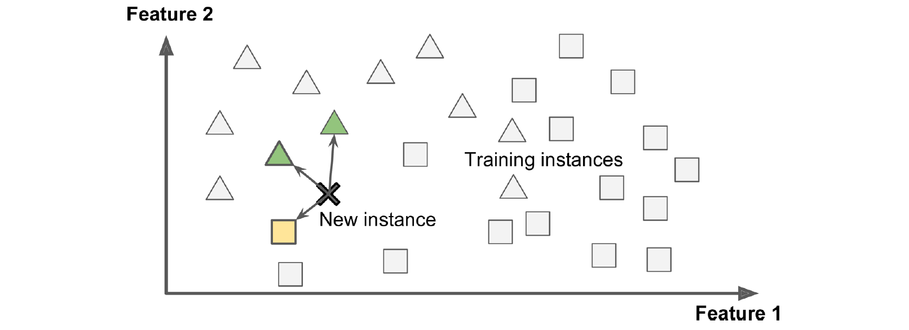

#### 基于模型学习
另一种泛化的方式是构建一个数据模型，然后用模型去预测。叫做“基于模型学习”。

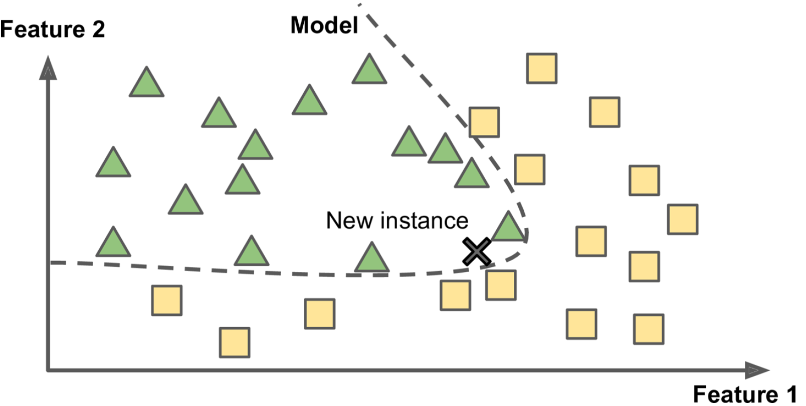

举例，你想知道钱是否令人幸福，然后从OECD网站下载Better Life Index数据，从IMF下载GDP数据，然后联表查询。

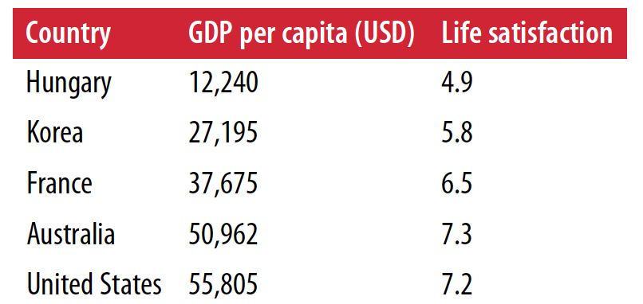

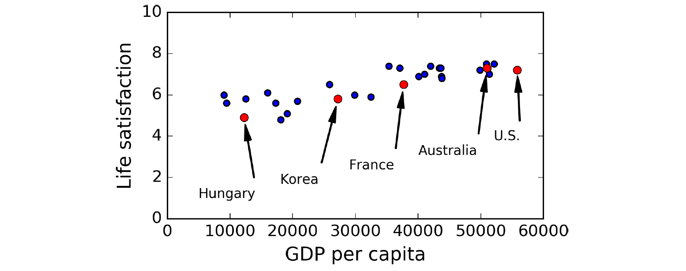

看起来确实有这个趋势，虽然数据有点噪声，但基本上钱是令人幸福的。所以你可以把生活满意度构建成一个人均GDP的线性函数模型。
这个过程叫做**模型选择(model selection)**：选择了一个生活满意度的线性模型，只有一个因素：人均GDP。

```
lifeSatisfaction = θ<sup>0</sup> + θ<sup>1</sup> × GDP_per_capita
```
这个模型有两个参数：θ<sup>0</sup>，θ<sup>1</sup>，对参数做一些调整后，模型可以表示任何线性函数。如下图：

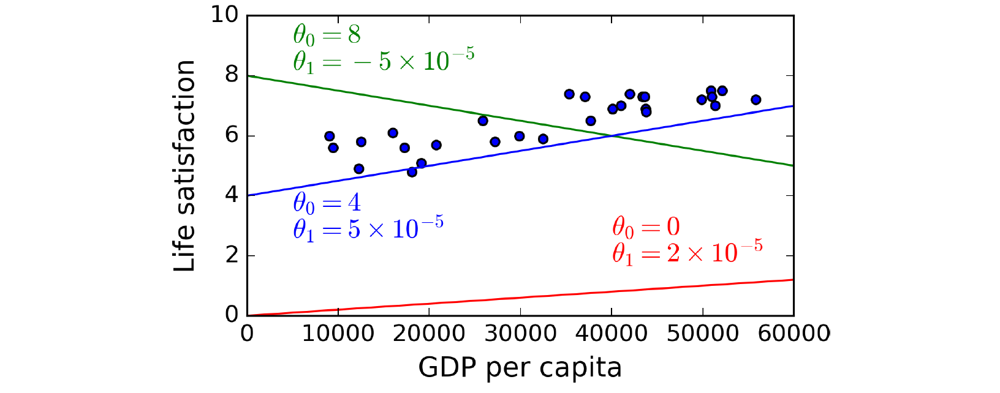

在使用模型前，需要定义参数θ<sup>0</sup>，θ<sup>1</sup>的值。怎样才能知道什么样的值让模型表现最优？需要确定一个性能指标才能回答这个问题。可以定义一个工具函数(utility function)来衡量模型有多好，也可以定义一个价值函数(cost function)来衡量模型有多差。对于线性回归问题，人们一般用价值函数(cost function)来衡量线性模型的预测与训练数据的差距，目标就是减少差距。

这也是线性回归算法的由来，你提供训练数据，算法找到最佳的适配数据的线性模型。这过程叫做**训练模型**，在上面这个例子中，最优值是
```
θ<sup>0</sup>=4.85，θ<sup>1</sup>=4.91 × 10<sub>–5</sub>
```
现在你想预测塞浦路斯人的幸福程度，塞浦路斯的人均GDP是$22,587，然后满意度的值是 4.85 + 22,587 × 4.91 × 10<sub>–5</sub> = 5.96

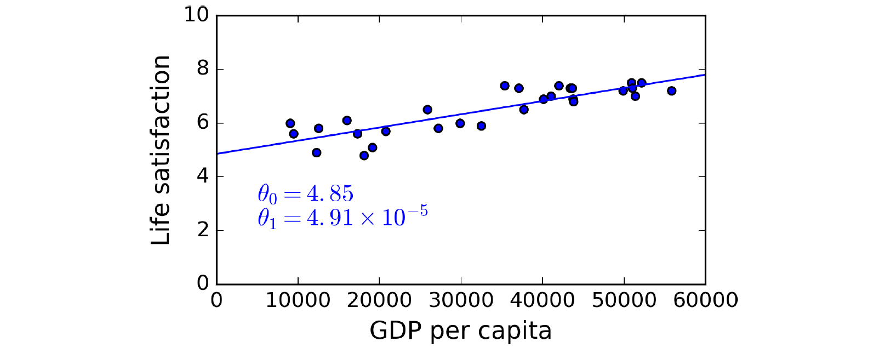

如果不满意这个模型的话，可能需要加入更多因素
，比如就业率，健康水平，空气质量等，取得更多或更优质的训练数据，或选择更强大的模型(比如多项式回归模型)。

总结开来，过程如下：
 1. 学习数据
 2. 选择模型
 3. 在训练数据上调优模型
 4. 应用模型到新数据上

这就是典型的机器学习项目的样子。
